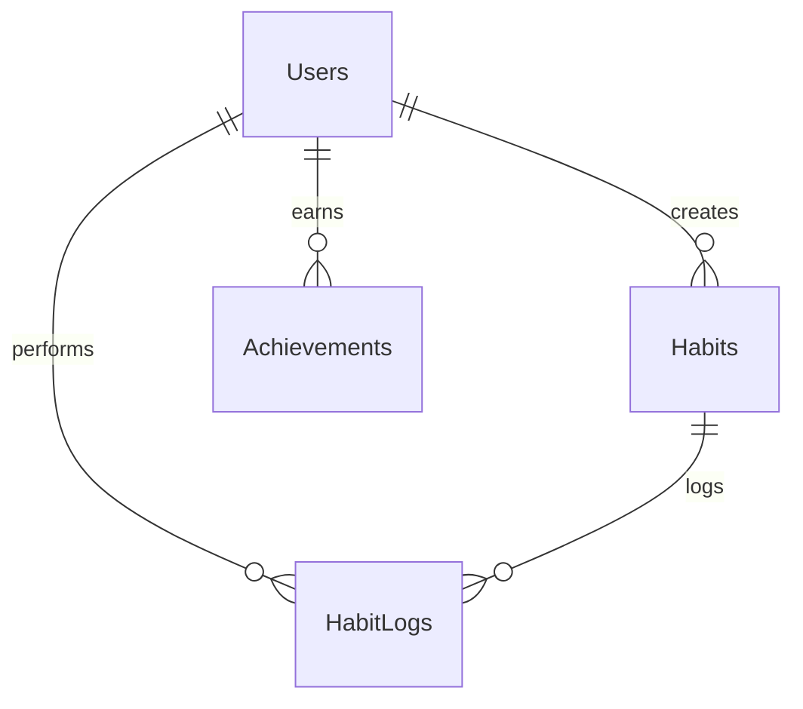

# Habit Hero - Google Sheets Database Schema

This document details the Google Sheets layout designed to serve as our relational database. We define four sheets: `Users`, `Habits`, `HabitLogs`, and `Achievements`.

---

## 1. Sheet: `Users`
Stores user profile information, authentication credentials, and overall gamification stats.

| Column Name | Data Type | Key Type | Description | Example Value |
| :--- | :--- | :--- | :--- | :--- |
| **UserID** | String (UUID) | Primary Key | Unique identifier for each user | `usr_l8p2m9q5` |
| **Name** | String | - | Display name of the user | `Alex Mercer` |
| **Email** | String | Unique Index | Email address (used to log in) | `alex@habithero.com` |
| **Password** | String (Hash) | - | Securely stored password for auth | `bcrypt_hash_or_plaintext` |
| **JoinDate** | Date (YYYY-MM-DD) | - | Timestamp when account was created | `2026-06-01` |
| **XP** | Number | - | Total accumulated experience points | `350` |
| **Level** | Number | - | Calculated level (derived from XP) | `3` |
| **Streak** | Number | - | Current consecutive days active | `7` |
| **LongestStreak** | Number | - | Historical maximum streak achieved | `14` |

---

## 2. Sheet: `Habits`
Stores habit definitions configured by users.

| Column Name | Data Type | Key Type | Description | Example Value |
| :--- | :--- | :--- | :--- | :--- |
| **HabitID** | String (UUID) | Primary Key | Unique identifier for the habit | `hab_k3j1n4h2` |
| **UserID** | String (UUID) | Foreign Key | Owner of the habit (references `Users.UserID`) | `usr_l8p2m9q5` |
| **HabitName** | String | - | Name of the habit | `Morning Run` |
| **Description** | String | - | Purpose or short description of the habit | `Run 3km in the park` |
| **Category** | String | - | Habit category (`Gym`, `Reading`, `Coding`) | `Gym` |
| **XPReward** | Number | - | Experience points rewarded on check-in | `10` |
| **Status** | String | - | Current state (`Active` or `Inactive`) | `Active` |

---

## 3. Sheet: `HabitLogs`
Tracks daily completions of habits.

| Column Name | Data Type | Key Type | Description | Example Value |
| :--- | :--- | :--- | :--- | :--- |
| **LogID** | String (UUID) | Primary Key | Unique identifier for the log entry | `log_z8x9c0v1` |
| **HabitID** | String (UUID) | Foreign Key | The habit logged (references `Habits.HabitID`) | `hab_k3j1n4h2` |
| **UserID** | String (UUID) | Foreign Key | User who logged it (references `Users.UserID`) | `usr_l8p2m9q5` |
| **Date** | Date (YYYY-MM-DD) | - | Date of check-in | `2026-06-01` |
| **Completed** | Boolean | - | Success state (`TRUE` = Completed, `FALSE` = Missed) | `TRUE` |

---

## 4. Sheet: `Achievements`
Stores badges and trophies unlocked by users.

| Column Name | Data Type | Key Type | Description | Example Value |
| :--- | :--- | :--- | :--- | :--- |
| **AchievementID** | String (UUID) | Primary Key | Unique achievement record identifier | `ach_v9b8n7m6` |
| **UserID** | String (UUID) | Foreign Key | Recipient of the badge (references `Users.UserID`) | `usr_l8p2m9q5` |
| **BadgeName** | String | - | Name of the badge unlocked | `7 Day Streak` |
| **UnlockedDate** | Date (YYYY-MM-DD) | - | Timestamp when achievement criteria were met | `2026-06-01` |

---

## Relationships & Integrity Rules

1. **Cascade Deletes**: If a user is deleted, their habits, logs, and achievements should be deleted.
2. **Uniqueness Rules**:
   - `Users.Email` must be unique.
   - For `HabitLogs`, the combination of `(HabitID, UserID, Date)` must be unique (only one check-in allowed per habit per day).
